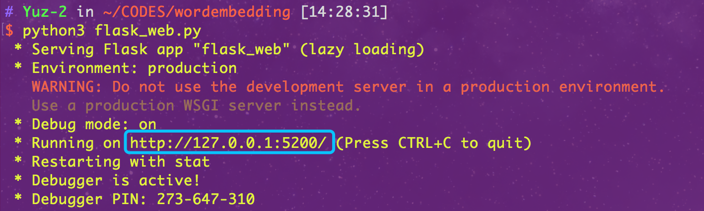

# Word Embeddings Demo

## 1. Files you may care

* `./templates/`and`./static`: these two dirs contain the html templates, css and javascript files for this web application.
* `backend.py`: this file contains functions for getting word similarity, finding near words through a word or its vector, and plotting the 2D or 3D figures for embeddings. 
* `flask_web.py`: this file contains the actions to render the html pages.
* `./mplot3d/`: this dir contains the dependency for plotting 3D figures.
* `./pics`: this dir contains pictures for the Markdown files.
* `./images`: this dir contains the temp figure file generated in the project.
* `./Test Cases`: this dir contains the test cases for the front and back ends of this project, including unit test and integration test.

## 2. Dependency

Dependencies of this web application are `flask`, `gensim`, `sklearn`, `matplotlib`, and `numpy`, which can be installed using `pip`.

`$ pip3 install flask gensim sklearn matplotlib --user`

## 3. Preparations

This web application requires the pretrained [GloVe Word Embeddings](https://nlp.stanford.edu/projects/glove/) (whose format should be changed to a loadable one by the Gensim model). This preparation can be done using the following command.

`$ python3 -m gensim.scripts.glove2word2vec --input  glove.6B.50d.txt --output glove.6B.50d.w2v.txt`

or you can run the `getGloVe.sh` shell script instead.

`$ ./getGloVe.sh`

## 4. How to run

Run the web app using the following command.

`$ python3 flask_web.py`

After that, this web application will be available at port 5200. 

## 5. How it works

### 5.1 Find Near

Find the words that are highly similar with the given word.

### 5.2 Find Between

Given two keywords with vectors `\vec{A}` and` \vec{B}` respectively, the distance between `\vec{A}` and `\vec{B}` are split into `n` parts. Let `\overrightarrow{AB}` donates `\vec{A} - \vec{B}`, then the vector of the words between `\vec{A}` and  `\vec{B}` can be represented as `Vector(i) = A + x*C`, where `x=i/n` and `1<=i<n `. Then we can use `Vector(i)`to find its most similar word vector.

## 6. How to use

### 6.1 At route `/`, there are two options, as shown in the following screen shot.

  

### 6.2 Near Analysis

  After you click the `Near_Analysis`  button, it will jump to the route `/wed`, where you can get the top-n near words for a given word. 

 You can input a word at position `1` and choose the top-n number at position `2`. After clicking the `Find Near` button, the following results will be given, where position `3` indicates the list of similar words.

  

  

### 6.3 Between Analysis

  After you click the `Between_Analysis`  button, it will jump to the route `/weds`, where you can get the top-n near words to each keyword and the most near word between the two keywords.

  You can input two keywords at postion `4` and `5` separately, choose the top-n near words at position `6`, and specify how many points you want to get at position `7`. After clicking the `Find Between` button, you 'll get the following results, where `x-value` means the percentage of the distance between word1 and word2.

  

  

